# GPSTopo — Automation Trigger Map (Zapier/Make)

Complete reference for all automated workflows in the GPSTopo system.

---

## 🎯 Automation Philosophy

**Goal:** Minimize manual touchpoints from order to delivery  
**Tools:** Zapier (primary), Make (backup), Stripe webhooks, Airtable/Trello APIs  
**Principle:** Every status change should trigger the next action automatically

---

## Automation Workflow Map

```mermaid
%% GPSTopo: Automation Trigger Architecture
graph TD
    A[Stripe Payment Success] -->|Webhook| B[Zapier: New Payment Trigger]
    B --> C[Create Project Card in Airtable/Trello]
    C --> D[Auto-Populate: Service, Amount, Client Info]
    D --> E[Trigger: Partner Assignment Logic]
    
    E --> F{Service Type + Location}
    F --> G[Query Partner Database]
    G --> H[Assign to Best Match Partner]
    H --> I[Send WhatsApp Notification]
    I --> J[Send Email with Project Details]
    
    J --> K[Partner Updates Status to 'Accepted']
    K --> L[Trigger: Client Status Update Email]
    
    L --> M[Partner Uploads Data: 'Field Complete']
    M --> N[Trigger: QC Assignment]
    N --> O[QC Reviewer Assigned + Notified]
    
    O --> P[QC Updates Status to 'Approved']
    P --> Q[Trigger: File Packaging]
    Q --> R[Generate Download Link]
    R --> S[Send Delivery Email to Client]
    
    S --> T[Wait 24 Hours]
    T --> U[Trigger: Feedback Survey Email]
    U --> V[Update Card Status to 'Closed']
    
    V --> W[Archive Project]

%% Lean Tip: Each status change is a trigger, not a manual checklist item
```



---

## Zap-by-Zap Breakdown

### ⚡ Zap 1: Stripe Payment → Create Project

**Trigger:** Stripe — New Payment  
**Filter:** Only successful payments  

**Actions:**
1. **Create Airtable Record** (or Trello Card)
   - Project ID: `{Stripe Payment ID}`
   - Service Type: `{Product Name}`
   - Client Name: `{Customer Name}`
   - Client Email: `{Customer Email}`
   - Address: `{Metadata: Address}`
   - Amount Paid: `{Amount}`
   - Status: "New Order"
   - Created Date: `{Current Date}`

2. **Send Internal Slack/Email Notification**
   - Message: "New order received: [Project ID] - [Service Type]"

**Estimated Time:** <30 seconds from payment

---

### ⚡ Zap 2: Project Created → Assign Partner

**Trigger:** Airtable — New Record Created (Status = "New Order")

**Logic Steps:**
1. **Lookup Partner** based on:
   - Service type required
   - Location proximity (Airtable formula or Google Maps API)
   - Current workload (<3 active projects)

2. **Update Project Card:**
   - Partner Name: `{Matched Partner}`
   - Partner Contact: `{Partner WhatsApp}`
   - Status: "Partner Assigned"

3. **Send WhatsApp Message** (via WhatsApp Business API or Twilio)
   - Template: "New project assigned: [Link]"

4. **Send Email** with full project details

**Estimated Time:** <5 minutes from project creation

---

### ⚡ Zap 3: Partner Accepts → Notify Client

**Trigger:** Airtable — Record Updated (Status = "Partner Accepted")

**Actions:**
1. **Send Email to Client:**
   - Subject: "Your GPSTopo project is underway!"
   - Body: "Our field partner has been assigned and will begin work shortly. Expected delivery: [Date]"

2. **Update Card:**
   - Status: "In Progress"
   - Start Date: `{Current Date}`

**Estimated Time:** Instant

---

### ⚡ Zap 4: Field Data Uploaded → Trigger QC

**Trigger:** Airtable — Record Updated (Status = "Field Complete")

**Actions:**
1. **Assign QC Reviewer:**
   - Round-robin or workload-based assignment

2. **Create QC Checklist** (Airtable or linked Google Doc)

3. **Send Notification** to QC reviewer

4. **Update Card:**
   - Status: "QC Review"
   - QC Assigned: `{Reviewer Name}`

**Estimated Time:** <5 minutes

---

### ⚡ Zap 5: QC Approved → Deliver Files

**Trigger:** Airtable — Record Updated (Status = "QC Approved")

**Actions:**
1. **Upload Files** to OneDrive/Google Drive (if not already there)

2. **Generate Shareable Link** (view-only)

3. **Send Delivery Email:**
   - Subject: "Your GPSTopo files are ready!"
   - Body: 
     ```
     Hi [Client Name],
     
     Your [Service Type] project is complete! 
     
     📂 Download your files: [Link]
     
     Files included:
     - [List of files]
     
     Questions or need revisions? Just reply to this email.
     
     — The GPSTopo Team
     ```

4. **Update Card:**
   - Status: "Delivered"
   - Delivery Date: `{Current Date}`

**Estimated Time:** <5 minutes

---

### ⚡ Zap 6: Delivery + 24 Hours → Feedback Survey

**Trigger:** Airtable — Record Updated (Status = "Delivered") + 24-hour delay

**Actions:**
1. **Send Feedback Email:**
   - Include Google Form or Typeform link
   - NPS question + open feedback

2. **Update Card:**
   - Status: "Closed"
   - Feedback Requested: "Yes"

**Estimated Time:** Exactly 24 hours after delivery

---

### ⚡ Zap 7: Payment Failed → Retry Notification

**Trigger:** Stripe — Payment Failed

**Actions:**
1. **Send Email:**
   - Subject: "Payment issue with your GPSTopo order"
   - Body: "We had trouble processing your payment. Please try again: [New Checkout Link]"

2. **Create Draft Project Card** (not assigned to partner yet)
   - Status: "Payment Pending"

**Estimated Time:** <1 minute

---

## Conditional Automation Rules

### Rush Order Handling

**If:** Order includes "Rush" in metadata  
**Then:** 
- Assign to partners with <2 active projects only
- Increase payout by 25%
- Send "URGENT" flag in notification

### ALTA-Specific Rules

**If:** Service Type = "ALTA/NSPS"  
**Then:**
- Only assign to PLS-licensed partners
- Require additional verification step before delivery
- Include compliance checklist in QC review

### Client Follow-Up (No Response)

**If:** Client hasn't downloaded files within 7 days  
**Then:**
- Send reminder email: "Your files are still available"
- Check if link expired → regenerate if needed

---

## Error Handling & Fallbacks

| Scenario | Automation Response |
|----------|---------------------|
| No partner available | Email ops team for manual assignment |
| Partner doesn't respond (2 hrs) | Re-route to backup partner |
| QC approval delayed >12 hrs | Send reminder to QC reviewer |
| File upload fails | Retry 3x, then alert ops team |
| Email bounce | Flag in Airtable, attempt SMS/WhatsApp |

---

## Testing & Monitoring

### Test Each Zap Monthly
- Create test Stripe payment
- Verify all triggers fire correctly
- Check email/notification formatting
- Confirm timing delays work

### Monitor These Metrics
- **Zap Success Rate:** Target >99%
- **Average Automation Latency:** <30 seconds per step
- **Failed Zap Count:** <5 per month
- **Manual Intervention Rate:** <5% of orders

---

## Backup Plan (If Automation Fails)

1. All Stripe payments still create records manually via CSV export
2. Ops team monitors Airtable/Trello for stuck cards
3. WhatsApp Business app available for manual notifications
4. Email templates saved for manual sending

---

*Automation only works if it's maintained. Review quarterly and optimize based on real-world usage.*

