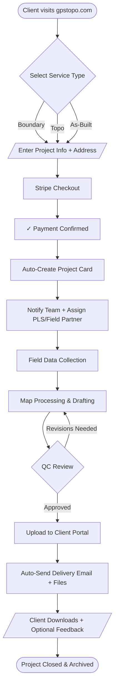

# GPSTopo Technologies - Online Order Workflow

## 100% Digital Survey Ordering Process

---

## Key Automation Points

| Step | Tool/Method | Automation Trigger |
|------|-------------|-------------------|
| Payment | Stripe Checkout | Form submission |
| Project Card | Trello/Airtable API | Stripe webhook |
| Team Notification | Email/Slack | Card creation event |
| Partner Assignment | Smart routing rules | Location + availability |
| QC Review | Checklist trigger | Status change to "Complete" |
| Delivery | Email + portal link | QC approval |
| Feedback | Survey link | Delivery confirmation |

---

## Process Metrics to Track

- **Order-to-Assignment Time**: Target < 2 hours
- **Field-to-Delivery Time**: Target < 48 hours
- **QC Pass Rate**: Target > 95% first-time
- **Client NPS**: Track via feedback link

---

*Last Updated: November 2025*

