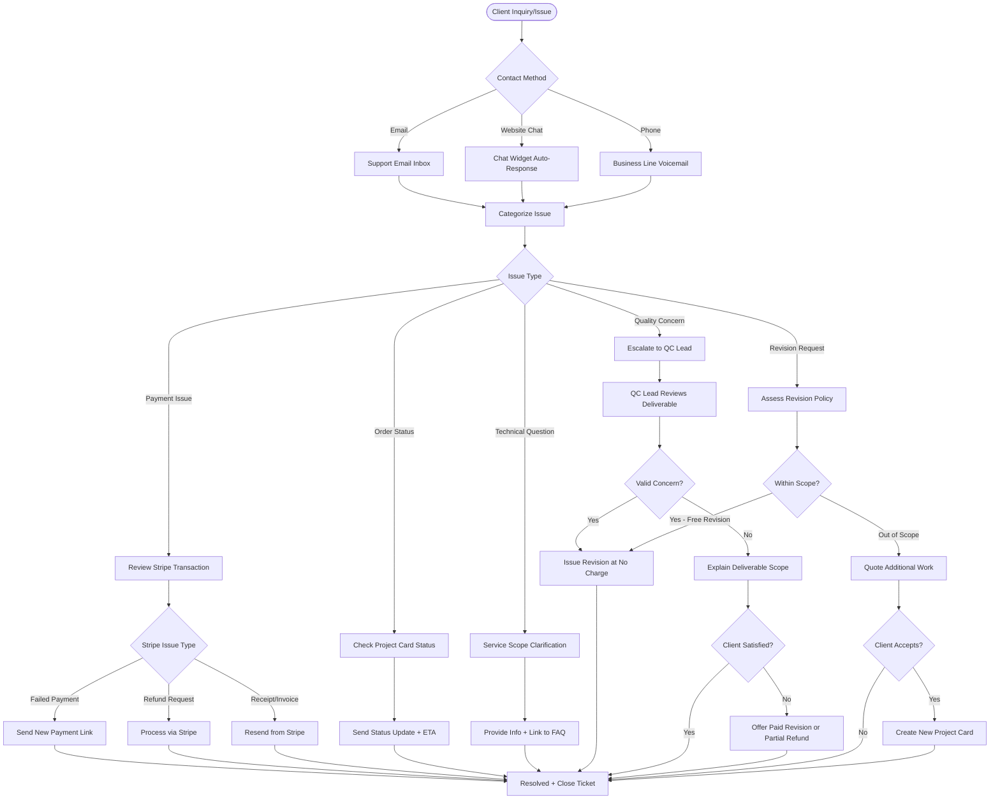

# GPSTopo — Customer Support Workflow



---

## Support Tiers & Response Times

| Inquiry Type | Priority | Response Time | Resolution Time |
|--------------|----------|---------------|-----------------|
| Order Status | Medium | <2 hours | Immediate |
| Payment Issue | High | <1 hour | <4 hours |
| Quality Concern | High | <2 hours | <24 hours |
| Technical Question | Low | <4 hours | Same day |
| Revision Request | Medium | <2 hours | 1-3 days |
| General Inquiry | Low | <4 hours | Same day |

---

## Revision Policy

### Free Revisions (Within Scope)

Client is entitled to **one free revision** if:
- Deliverable contains errors (wrong coordinates, missing elements, etc.)
- Original scope was not fully met
- QC checklist item was missed

### Paid Revisions (Out of Scope)

Client must pay for additional work if:
- Request adds new elements not in original order
- Client wants different format or style preference
- Design changes to original scope

**Paid Revision Rate:** 50% of original service price (minimum $150)

---

## Common Support Scenarios & Responses

### Scenario 1: "Where is my order?"

**Template Response:**
```
Hi [Client Name],

Your project is currently [Status]. Based on the service type, your 
expected delivery is [Date].

Current Progress:
- ✅ Payment received
- ✅ Field partner assigned
- 🔄 Data collection in progress
- ⏳ QC review pending

You'll receive an automatic email once files are ready. Questions? 
Just reply here!

— GPSTopo Team
```

---

### Scenario 2: "The map doesn't match what I need"

**Response Flow:**
1. Review original order form + scope
2. Compare deliverable to QC checklist
3. Determine if issue is in-scope or out-of-scope

**Template (In-Scope):**
```
Thanks for bringing this to our attention. After reviewing your 
original order, we agree this should have been included. 

We'll issue a corrected version within 24-48 hours at no charge.

Apologies for the oversight!
```

**Template (Out-of-Scope):**
```
Thanks for your feedback! After reviewing your original order, 
the elements you're requesting fall outside the standard [Service Type] 
scope.

We'd be happy to provide those additional details as a revision. 
Cost: $[Amount] | Turnaround: [Days]

Would you like us to proceed?
```

---

### Scenario 3: "Payment failed / I need a refund"

**Payment Failed:**
```
We see the payment didn't go through. Here's a new checkout link 
to complete your order: [Link]

If you're having trouble, feel free to call us at [Phone] and we 
can process it manually.
```

**Refund Request (Before Work Started):**
```
No problem! We've processed a full refund via Stripe. You should 
see it in 5-7 business days.

Order [ID] has been cancelled.
```

**Refund Request (After Delivery):**
```
We're sorry you're not satisfied. We've reviewed the deliverable 
and believe it meets the scope of [Service Type].

However, we value your business. We can offer:
1. Free revision to address specific concerns
2. 50% refund + keep the files
3. Full refund + return of files

Let us know which works best.
```

---

## Support Automation

### Auto-Responses (Chat Widget)

```
👋 Hi! Thanks for reaching out to GPSTopo.

Our team typically responds within 2 hours during business hours 
(M-F, 9am-6pm ET).

For immediate help:
📦 Track your order: [Link]
❓ FAQs: [Link]
📞 Call/Text: [Phone]
```

### Auto-Email Templates (Triggered)

1. **Payment Received:** "Your order is confirmed!"
2. **Partner Assigned:** "Your project is underway"
3. **Delivery Ready:** "Your files are ready for download"
4. **Feedback Request:** "How did we do?" (sent 24 hours after delivery)

---

## Escalation Path

1. **Tier 1:** General inquiries (handled by operations team)
2. **Tier 2:** Technical/QC issues (escalated to QC lead or founder)
3. **Tier 3:** Legal/compliance concerns (escalated to PLS or legal counsel)

---

*Great support turns one-time clients into repeat customers.*

