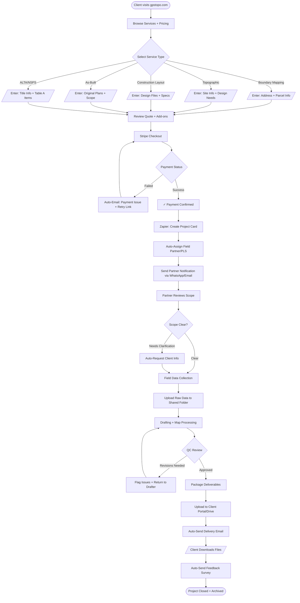

# GPSTopo — Main Order Workflow (Service-Specific)

---

## Service-Specific Turnaround Times

| Service | Target Turnaround | Rush Option |
|---------|-------------------|-------------|
| Boundary Mapping | 3–5 business days | +50% fee for 24-48hr |
| Topographic | 5–7 business days | +75% fee for 3-day |
| Construction Layout | 48–72 hours | Same-day available |
| As-Built | 3–5 days | +50% for 48hr |
| ALTA/NSPS | 10–15 days | Jurisdiction-dependent |

---

## Automation Trigger Points

1. **Stripe Payment Success** → Create Trello/Airtable card
2. **Card Created** → Assign partner based on rules
3. **Partner Assigned** → Send WhatsApp notification
4. **Status = "Data Uploaded"** → Trigger QC checklist
5. **QC Approved** → Package files + send delivery email
6. **Delivery Confirmed** → Send feedback survey after 24 hours

---

*Last Updated: November 2025*

