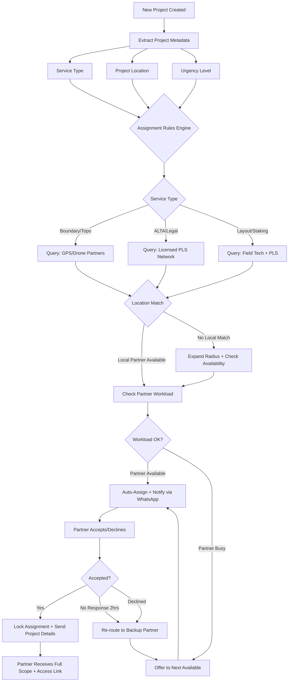

# GPSTopo — Field Partner / PLS Assignment Workflow



---

## Partner Assignment Rules

### Rule 1: Service Type Matching

| Service | Required Partner Type |
|---------|----------------------|
| Boundary Mapping | GPS tech or PLS (depends on state) |
| Topographic | Drone operator or GPS tech |
| Construction Layout | Field tech + PLS verification |
| As-Built | Field tech + PE/PLS certification |
| ALTA/NSPS | Licensed PLS only |

### Rule 2: Location Proximity

- **Preferred:** Within 30-mile radius of project site
- **Acceptable:** Within 60-mile radius (may incur travel fee)
- **Remote:** Beyond 60 miles (requires special approval or higher rate)

### Rule 3: Workload Balancing

- **Max Active Projects per Partner:** 3 concurrent
- **Rush Projects:** Only assign to partners with <2 active projects
- **ALTA Projects:** Reserve for partners with proven track record (>90% QC pass rate)

### Rule 4: Response Time SLA

- **Partner Response Time:** 2 hours to accept or decline
- **No Response Action:** Auto-route to backup partner
- **Partner Cancellation:** Must notify >24 hours in advance (except emergencies)

---

## Partner Communication Flow

### Step 1: Initial Assignment Notification (WhatsApp + Email)

```
📍 New Project Assigned: [Project ID]
Service: [Boundary / Topo / ALTA]
Location: [Address]
Deadline: [Date]
Pay: $[Amount]

🔗 View Details: [Link]
✅ Accept | ❌ Decline
```

### Step 2: Acceptance Confirmation

```
✅ Project [Project ID] confirmed!
📂 Access project files: [Link]
📞 Client contact: [If needed]
📅 Expected completion: [Date]

Questions? Reply here or call our ops line.
```

### Step 3: Reminder (24 hours before deadline)

```
⏰ Reminder: Project [Project ID] due tomorrow
Status: [In Progress / Not Started]

Need extension? Let us know ASAP.
```

---

## Partner Performance Metrics

Track these metrics per partner for assignment optimization:

| Metric | Target |
|--------|--------|
| **Acceptance Rate** | >80% |
| **On-Time Delivery Rate** | >95% |
| **QC First-Pass Rate** | >90% |
| **Average Response Time** | <1 hour |
| **Client Feedback Score** | >4.5/5 |

---

## Automation Tools

- **Zapier/Make:** Trigger assignment on project card creation
- **Airtable Formula:** Auto-calculate partner availability based on active project count
- **WhatsApp Business API:** Send instant notifications
- **Google Maps API:** Calculate proximity and travel time

---

*Partner network management is key to scalability and consistent quality.*

