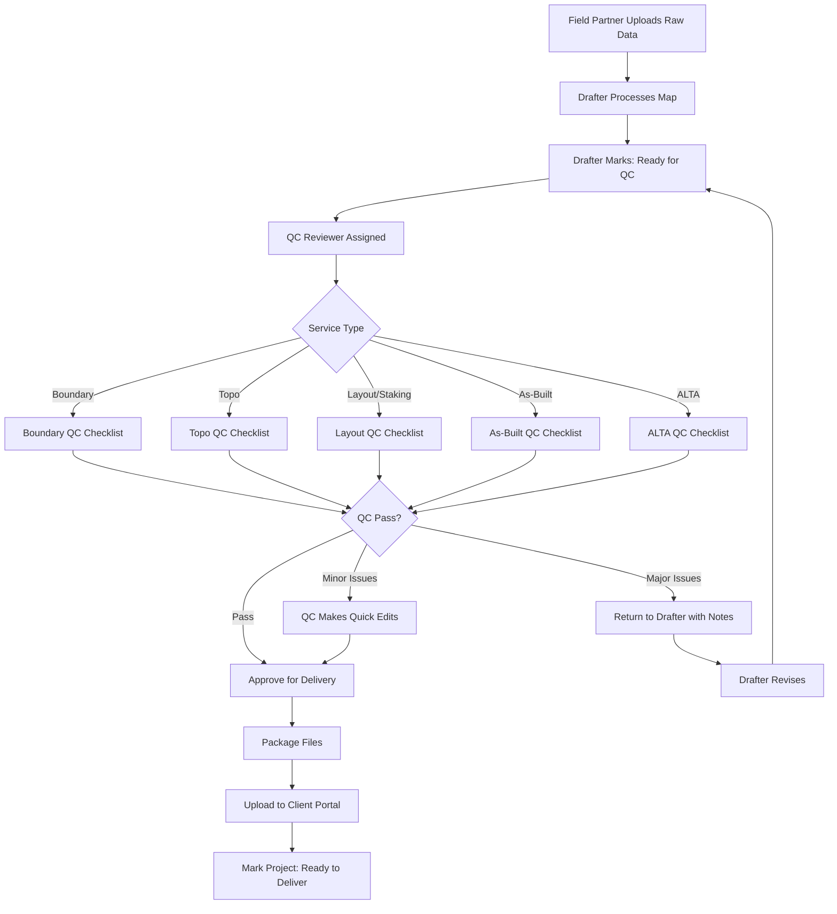

# GPSTopo — Quality Control (QC) Review Process

---

## QC Checklists by Service Type

### 1. Boundary Mapping QC

- [ ] Property lines match parcel GIS data
- [ ] Lot dimensions labeled clearly
- [ ] North arrow and scale present
- [ ] Legal description included (if provided)
- [ ] Disclaimer text present
- [ ] File exports correctly (PDF + DWG)

### 2. Topographic QC

- [ ] Contour intervals labeled and consistent
- [ ] Spot elevations at key points
- [ ] Coordinate system noted
- [ ] Base flood elevation (if applicable)
- [ ] Legend includes all symbols
- [ ] CSV data matches drawing coordinates

### 3. Construction Layout QC

- [ ] Stake points match design intent
- [ ] Offset distances clearly marked
- [ ] Benchmark/control points referenced
- [ ] Coordinate list included
- [ ] Site-specific notes from field partner reviewed

### 4. As-Built QC

- [ ] As-built elements clearly distinguished from design
- [ ] Elevation verifications documented
- [ ] Variance notes (if any) included
- [ ] Certification letter matches scope
- [ ] PE/PLS signature obtained (if required)

### 5. ALTA/NSPS QC

- [ ] Table A items addressed
- [ ] Title commitment elements shown
- [ ] Easements and encroachments identified
- [ ] Certification wording matches lender requirements
- [ ] PLS signature and seal present
- [ ] State-specific compliance verified

---

## QC Review Timeline

| Step | Target Time |
|------|-------------|
| Drafter marks "Ready for QC" | Immediate notification |
| QC review begins | Within 4 hours |
| QC decision | Within 2 hours of start |
| Revision turnaround (if needed) | Within 24 hours |

---

## QC Metrics to Track

- **First-Time QC Pass Rate** (target: >95%)
- **Average QC Review Time** (target: <2 hours)
- **Revision Rate by Drafter**
- **Common Issue Categories** (for training)

---

*Published in GitHub Codex for transparency and continuous improvement.*

